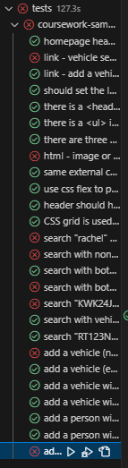
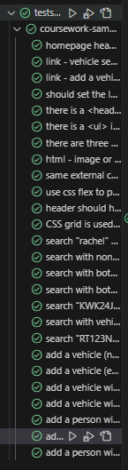

# COMP1004 Coursework 2

## HTML files

#### Head 
- Within the head of the HTML file we have all the information needed from lines 4 to 11
- Doctype and Language: The document type is declared at the beginning `<!doctype html>` and the language is set to English `<html lang="en">`.
- Meta Tags: There are meta tags for character set and viewport in the `<head>` section, they allow for the HTML to by more dynamic across different screen size
- Links and Scripts: There are links to a CSS file `'styles/template.css'` and scripts `'@supabase/supabase-js@2'` which assists the the file `'components/peoplesearch.js'`W which handles requests to and from the database.

#### .container
- Body: The `<body>` element wrapped the `<main>` and `<aside> `, as firstly an HTML document is expected to have a body. Secondly, it’s where the main content of the page is rendered in the browser. Without it, the HTML document is not compliant with the HTML rendering standards and could result in unexpected browser behaviour 
- Container: the `
`, with class = 'container', was used as this allows it to be modified to arrange it in a desired format
- Elements: 4 semantic elements were used `<header>`,`<aside>`,`<main>` and `<footer>`. They were all placed within in the `
` container, and CSS was used to arrange them into their desired location
- ALT Text (Line 23): Within the `<aside>` there is an image, an `img` requires an alt text to pass lighthouse tests as it gives the user some context for the image
- Nav Links(Lines 16-22): `<nav>` are used to surround the `<ul>` element containing the relevant links the other pages. Nav Links are where links to other parts of the website are located

## CSS - `'template.css'`

- Border, Margin, Padding(Lines: 1-5): 
  - As all 4 of the required semantic elements require the same styles, as per the specification document, having 10px of padding and margin and also a 1px black border, did this to all the elements at the same time

- .container (Lines 7-11): 
  - `display` property is set to a grid which allows them to be placed in a structured format in desired places on the screen
  - `grid-template-columns` is used to determine how many columns there are and their ratio. In this case the ratio of column 1 to 2 is 1:4.  
  - the rows are not needed to be edited as they can then manage the size based on the size of the content within it. This makes it more dyamic to the size of the screen and content.

- Header(Lines 12 - 20): 
  - `grid-row: 1` and `grid-column: 1/5`-These properties place the header in the first row and span it from the first to the fifth grid line of the grid container.
  - `display: flex` - makes the header a flexible container, allowing its children to be laid out in a row or column and their sizes to adjust flexibly
  - `flex-direction` - determines the direction of the flexible items inside the header. In this case, it’s set to column, which stacks the children of the header vertically. So it puts the `<header>` above the `<nav>` links.

- header > h1 (Lines 21-24):
  - `>` is used between 'header' and 'h1' as this then only applies the css to the h1 elements within the header
  - `margin-bottom: 10px` - is used to put a gap between itself and the `<nav>` links

- header>nav>ul (Lines 25-31 ):
  - This only applied to `<ul>` elements within the `<nav>` element that is inside `<header>`
  - `display: flex`: This property makes the unordered list `<ul>` a flexible container. This allows its children to be laid out in a column and their sizes to adjust flexibly which will be done within the following.
  - `justify-content: space-around`: This property aligns the flexible container's items along the horizontal line and distributes the space around the items evenly. This means there will be equal space around each list item.
  - `list-style-type: none`: This property removes the bullet points that are displayed before each list item in an unordered list.
  - `font-size: large`: This property sets the font size of the text within the list items to be large.

- footer (Lines 32-37):
  - `grid-row: 3` and `grid-column: 1/5`-These properties place the footer in the third row and span it from the first to the fifth grid line of the grid container.
  - `justify-content: center` - this property is used to move all the content within the center of the page
  - `display: flex` - This property allows its children to be laid out in a column and their sizes to adjust flexibly which will be done within the following.

- aside (Lines 39-42):
  - `grid-column: 1` - This property puts the side menu only in the first column
  - `grid-row: 2;` - this property puts the side menu in the 2 row so its below the header and above the footer

- img (Lines 43-45):
  - `max-width: 100%` - this property the image always utilises the maximum width again

- main (Lines 39-42):
  - `grid-column: 2/5` - This property puts the main in columns 2 to 5 so that its ratio with `<aside>` is 1:4
  - `grid-row: 2` - this property puts the main in the 2 row so its below the header and above the footer

- form>ul (Lines 52-56):
  - `padding: 5px 10px` - this property places 5px of horizontal padding and 10px of vertical padding to place some distance between the list and the border of the `<main>`
  - `list-style-type: none`: This property removes the bullet points that are displayed before each list item in an unordered list.
  - `font-size: large`: This property sets the font size of the text within the list items to be larger than standard.

- form>ul>li (Lines 58-60):
  - `margin: 20px` - places 20px of margin around each list item so there is some space apart from them making it more readable

- .submitbutton, .addbutton (Lines 62 - 65):

  - `background-color: white` - sets it to white as it changes when hovered over, so needs to be reset when the mouse doens't hover
  - `width: fit-content` - makes the button fit the text within the button improving the button visually

.submitbutton:hover (Lines 67-69):
  - `background-color: lightgray` - sets the backround colour of the button to 'lightgray' when the mouse hovers over the button

.results (Lines 71-81)
  - `margin: 20px` - places 20px of margin around each result item so there is some space apart from them making it more readable
  - `padding: 10px 40px` - places 10px of padding on the top and bottom and 40px of padding on the sides so that there is space between the child items and each other and the parent element border
  - `display: flex` - This property allows its children to be laid out in a column or row and their sizes to adjust flexibly
  - `flex-wrap: wrap` - this property makes that if the child elements are too wide to fit the size of the screen they will wrap to the next row
  - `gap: 40px` - this puts 40px gap between the child elements so they are not too close together
  - `border-style: dashed` - changes the border to be dashed border to match that of the specifications document

- .person, .vehicle(Lines 80-87):
  - comma between person and vehicles means that the css will be applied to both of them
  - `font-size: large` - This property sets the font size of the text within the list items to be larger than standard.
  - `border: solid #000` - this property create a black solid border surronding the data within
  - `border-width: 2px` - this property causes the border to made to 2px to make it a bit thicker
  - `padding: 10px` - this property places  10px of padding to place some distance between the items which make it easier to read

- @media only screen and (max-width: 499.99px) (Lines 88 - 129):
  - This provides a different css when the screen is smaller than 500px 
  - Footer and aside now share the same row 
    - aside: `grid-column: 1` and footer: `grid-column: 2/5` which makes the ratio between the aside and footer 1:4 
    - main has its own row now above footer and aside but still below header being in row 2

## Java Script
#### Overall Structure 
  1. The JavaScript code begins with an import statement to bring in the necessary module `createClient` from Supabase.
  2. It then initializes a Supabase client using `createClient` with the appropriate URL and API key.
  3. After that, it logs the Supabase instance to the console, indicating a successful connection.
  4. Event listeners are set up to respond to user interactions, specifically when the 'Add' button is clicked.
### peoplesearch.js
- Lines 9 - 20 - async fetchData()
  - its asynchronous as it uses await as this process may take a while
  - logs the data if its successfull or error if there was an error fetching the data

- Lines 28 - 49
  - event listener that listen to the `submit` button 
  - it then calls the fetchData() function and then checks if the name or license number already exists
  - if there are results found it turns on the dashed border and adds elements to the `element`
  - if there is an error or no results found nothing is put in the results box and a relevant message is displayed

- Line 54 - 91
  - determines whether the person exists or not and whether the inputs are valid
- Lines 93 - 98
  - adds person data to element to be added to results section 

### vehiclesearch.js
- Lines 29 - 48
  - there is an event listener that waits until the `submit` button is pressed
  - called outputSearhcData which finds and determins the validity of the search
  - manages output to `message` element based on the return of outputSearchData

- Lines 53 - 81
  - determines whether the vehicle registration exists and then calls addOutput if the search is valid
  - does all search validation checks and manages errors

- Lines 85 - 90
  - adds all vehicle data to element that is added to `results` element

### add-vehicle.js

- Lines 31 - 53 -> checkVehicleFields:
   - This function validates the input fields related to adding a vehicle.
   - It checks if any of the fields are empty and displays an appropriate error message if so.
   - It also checks if the vehicle registration already exists in the database and if the owner exists.
   - If the owner doesn't exist, it allows for the addition of a new owner by calling addNewOwner()
   - Returns `true` if all checks pass, indicating the fields are valid for adding a vehicle; otherwise, returns `false`.

- Lines 56 - 69 -> checkField:
    - This generic function checks if a given value exists in a specified column of a table in the database.
    - It fetches data from either of the 2 tables and loops through the results to check for a match.
    - Returns `true` if a match is found; otherwise, returns `false`.

- Lines 71 - 84 getOwnerId:
    - This function retrieves the `PersonID` of the vehicle owner based on their name.
    - It fetches data from the 'People' table and checks for a match with the provided owner name.
    - Returns the `PersonID` if found; otherwise, returns `null`.
    - this function is needed over the generic function checkField as the personId number is needed for when inserting a new vehicle

- Lines 86- 106 -> addVehicle: 
    - This function inserts a new vehicle entry into the 'Vehicles' table in the database.
    - It takes the vehicle details along with the `ownerID` and inserts them into the database.
    - It also updates the message element with success or error messages based on the outcome.
    - Returns `true` if the vehicle is successfully added; otherwise, returns `false`.

- Lines 108 - 142 -> addNewOwner:
    - This function allows for the addition of a new owner if the entered owner does not exist in the database.
    - It dynamically updates the form by adding new HTML elements to the HTML page and removing some old ones to include fields for adding a new person.

- Lines 224 - 229 -> Page Reset Functionality
  - A `resetPage()` function is provided to reset the form back to its original state. This is done by saving the original HTML of the form and when the reset function is called the inner html is set back to it

## Supabase

### **Row Level Security Policies**

### Insert
An insert policy was needed within the database for both tables to allow the javescript to insert data in the add vehicle page

### Select
A select policy was needed within the database for both tables as this gives the javascript files access to the database so that it can be displayed to the webiste.

## Playwright
### Tests fail initially when pressing  run all 

#### Initially, if you press the run all tests button some tests fail at random, I think this may be due to the database struggling to handle multiple requests at once. 

#### However, if you then go back and run each test individually then they will all pass
- unless one of the tests that failed was an add valid vehicle or owner, then it may fail again as it was added to the database but returned the wrong value and would now fail as the driver/vehicle already exists